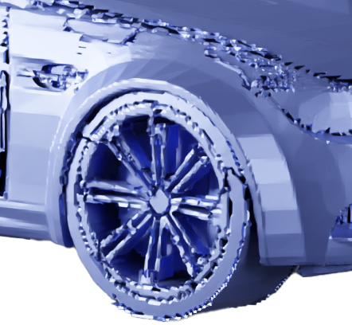
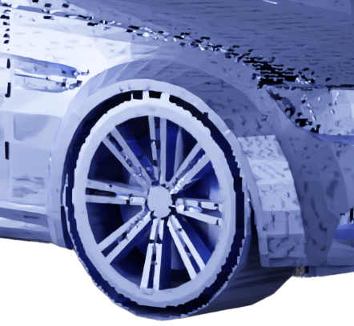
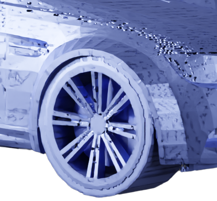

# Neural Surface Detection for Unsigned Distance Fields

[Project page](https://ilceltico.github.io/nsdudf/) | [ArXiv](https://arxiv.org/abs/2407.18381)

Pytorch implementation of the ECCV 2024 paper "Neural Surface Detection for Unsigned Distance Fields", Federico Stella, Nicolas Talabot, Hieu Le, Pascal Fua. École Polytechnique Fédérale de Lausanne (EPFL), Switzerland.


 |  |  | 
:---: | :---:| :---:| :---:
[MeshUDF](https://arxiv.org/abs/2111.14549) | Ours + [Marching Cubes](https://dl.acm.org/doi/10.1145/37402.37422) | [DualMesh-UDF](https://arxiv.org/abs/2309.08878) | Ours + [DualMesh-UDF](https://arxiv.org/abs/2309.08878)

*To output these models, run the example file with grid resolution 513 and with both meshing options.

## Installation
### Step 1
For the code to work, you need:
```
Python
Numpy
Pytorch
Trimesh
Cython
Libigl
Setuptools
```

Alternatively, you can find my Conda environment for macOS in [requirements_macos_conda.txt](requirements_macos_conda.txt), and my Pip package list for CUDA in [requirements_cuda_pip.txt](requirements_cuda_pip.txt). A GPU is not required to run the code, but of course it speeds up the execution.

### Step 2
Compile the Cython implementation of Marching Cubes if you intend to use it. Make sure to specify the path to your Numpy installation.
```
cd custom_mc
export CFLAGS="-I path_to_numpy/core/include/ $CFLAGS"
python setup.py build_ext --inplace
```

To use DualMesh-UDF, see below.


## Usage
A runnable and fully commented usage example is provided in the file [example_extract_mesh.py](example_extract_mesh.py).

In practice, you only need to do four things:

1. Load our pre-trained weights, the same as in the paper, with:
    ```
    model = utils.load_model("model.pt", device)
    ```
    These pre-trained weights are used for all the experiments in the paper (ablations obviously excluded).
2. Define the function `udf_and_grad_f`

    You can find two examples in [example_extract_mesh.py](example_extract_mesh.py).

    This function computes the UDF and the gradients for `N` input query points. Expected output shapes are `(N)` for the UDF and `(N,3)` for the gradients.
    We suggest batching the function to avoid memory problems. 
    
    If possible, we suggest normalizing the mesh to a [-1,1] bounding box as shown in the example; it is not mandatory. 
3. Compute the Pseudo-SDF by calling:
    ```
    pseudo_sdf = compute_pseudo_sdf(model, lambda query_points: udf_and_grad_f(query_points, object), n_grid_samples=resolution, batch_size=10000)
    ```
    with the required resolution. The batch size can be adjusted to avoid excessive memory usage.

    Note: the Pseudo-SDF has shape `(resolution-1, resolution-1, resolution-1, 8)`, because it contains a sign configuration for each grid cell. It is not a true SDF, hence the name. This means that SDF-based algorithms should be slightly modified to retrieve the signs correctly.
4. Mesh the output.

    The output can be meshed using Marching Cubes, which we provide with a slight interface modification to accept our Pseudo-SDF input. You can mesh it with a different algorithm and a corresponding interface modification.
    ```
    pseudosdf_mc_mesh = mesh_marching_cubes(pseudo_sdf)
    ```

## Integration with [DualMesh-UDF]((https://github.com/cong-yi/DualMesh-UDF))
We provide here a modified version of DualMesh-UDF with relaxed heuristics. All rights of the code to the original authors!
### Install
```
cd DualMesh-UDF
pip install .
```

### Usage
DualMesh-UDF requires two functions: one that extracts the UDF and one that extracts the UDF and the gradients. You can see examples in [example_extract_mesh.py](/example_extract_mesh.py).
Then you can call:
```
dmudf_mesh, pseudosdf_dmudf_mesh = mesh_dual_mesh_udf(pseudo_sdf, lambda query_points: udf_f_dmudf(query_points, gt_mesh), lambda query_points: udf_grad_f_dmudf(query_points, gt_mesh), batch_size=args.batch_size, device=args.device)

```
The first mesh is extracted by the original DualMesh-UDF directly from the UDF. The second mesh is extracted using the information from the Pseudo-SDF. Try to mesh a ShapeNet Car to see the difference!

Note that DualMesh-UDF requires grid sample resolutions of `2^k+1`, otherwise it won't work. E.g. `129`, `257`, `513`.

## Training
If you want to train your own network you will need a watertight dataset, because the SDF is needed as ground truth for the training. In the paper we used the first 80 shapes from the first chunk of ABC, which you can download [here](https://deep-geometry.github.io/abc-dataset/): 

1. Pre-process the data to speed up the training phase. It should take less than 10 minutes using our training split, and it does not require a GPU.
    ```
    create_dataset.py
    ```
    This script will extract the UDF and SDF on a grid, filter out grid cells far from the surface, and prepare the inputs for the network. As global variables in the script you can set the grid resolution(s) (128 in the paper), the dataset location and the list of shapes to use from the specified dataset. The list of ABC shapes used in the paper is in [datasets/abc_obj_list_train_80.txt](/datasets/abc_obj_list_train_80.txt). The script will use the first 80% of the list as training (corresponding to exactly 80 shapes in our list), and the rest as validation.

    In the [datasets](/datasets) directory you can also find the list of shapes used for the other datasets in the paper: MGN, Shapenet Cars and the 300 evaluation shapes for ABC.

2. Train the network. 
    ```
    train.py --device [cpu|mps|cuda]
    ```
    It should take around 10 minutes on CPU and 1-2 minutes on a recent CUDA-capable GPU.

    There are many other command line arguments, which you can find inside the script. By default, it uses the same parameters as in the paper.


## Bibtex
If you find this work useful, please cite us!
```
@misc{stella2024neuralsurfacedetectionunsigned,
      title={Neural Surface Detection for Unsigned Distance Fields}, 
      author={Federico Stella and Nicolas Talabot and Hieu Le and Pascal Fua},
      year={2024},
      eprint={2407.18381},
      archivePrefix={arXiv},
      primaryClass={cs.CV},
      url={https://arxiv.org/abs/2407.18381}, 
}
```